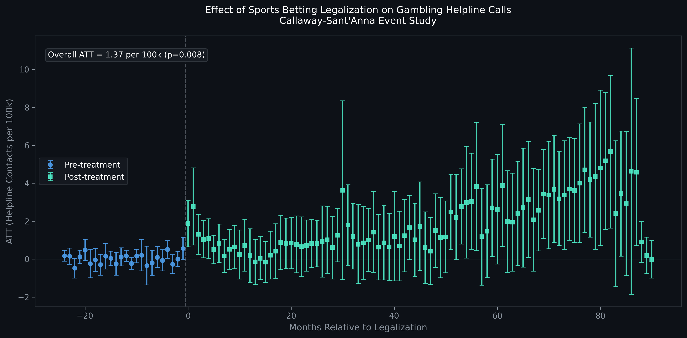

## Does sports betting legalization increase problem gambling helpline contacts?
A difference-in-differences analysis of staggered state-level legalization 
on NCPG helpline volume, 2016–2025.

## Motivation
Since the Supreme Court struck down PASPA in 2018, sports betting has expanded 
rapidly across the United States. Today, advertisements for DraftKing and FanDuel are inescapable: 
on television, in stadiums, and embedded in sports broadcasts. 
While the economic benefits of legalization are widely discussed, the 
public health consequences are less understood. This project uses state-level 
variation in legalization timing as a natural experiment to estimate the causal 
effect of sports betting legalization on problem gambling helpline contact volume, 
using monthly NCPG helpline data across 46 states from 2016 to 2025.

**Key finding:** 
Sports betting legalization increases gambling helpline contacts by **1.37 per 
100,000 residents** on average (p=0.008, 95% CI [0.38, 2.39]). Against a 
pre-legalization baseline of ~6-8 contacts per 100k, this represents a 17-23% 
increase in help-seeking behavior. The effect is not immediate: it builds 
gradually over time, consistent with addiction developing slowly as betting 
becomes habitual. Results are robust across three independent estimators 
(Callaway-Sant'Anna, Sun-Abraham, Borusyak-Jaravel-Spiess) and two control 
group specifications.

## Event Study Plot

Pre-treatment coefficients are flat and centered near zero, supporting the 
parallel trends assumption. The effect turns positive at legalization and 
grows over time, with the largest effects observed 4-7 years post-legalization 
among early-adopting states.

## Reproducing this Analysis
```bash
git clone https://github.com/kayvanns/Impact-of-Sports-Betting-Legalizations-on-Problem-Gambling
cd Impact-of-Sports-Betting-Legalizations-on-Problem-Gambling
pip install -r requirements.txt
```

Run notebooks in order:
- `01_eda.ipynb` — exploratory data analysis
- `02_panel_construction.ipynb` — cohort assignment, interpolation, population normalization
- `03_did_analysis.ipynb` — Callaway-Sant'Anna estimation, robustness checks
- `04_visualizations.ipynb` — event study and cohort trend plots

## Data Access

Helpline data is provided by the National Council on Problem Gambling (NCPG) 
under a data agreement and cannot be redistributed. State sports betting legalization 
dates were compiledmanually from state gaming commission announcements. Population data
is from the U.S. Census Bureau intercensal estimates.

## Limitations
HonestDiD sensitivity bounds (Rambachan & Roth 2023) were uninformative in this 
setting due to the long post-treatment horizon (up to 90 months). Allowing violations across 
all post-periods, produced bounds too wide to be useful at this time scale. Robustness is 
instead established via cross-estimator agreement and control group sensitivity checks.
